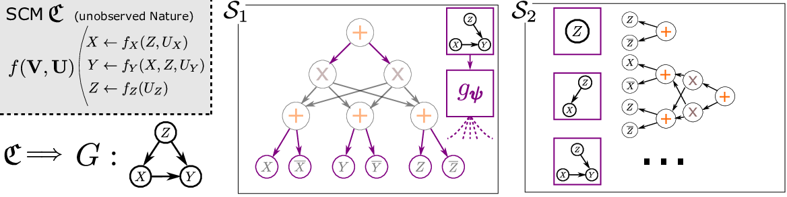

### Tractable Neural Causal Models

Official code repository for the corresponding paper.

Contains a partial re-implementation of [Xia et al. 2021](https://arxiv.org/abs/2107.00793).

---

**Code Structure:**

* `aux` contains helper functions
* `models` contains base functions like neural nets, sum-product networks but also the actual (T)NCM
* `expX` reproduces an experiment as found in the paper

---

**Installation on Ubuntu 22.04**

* install missing library with `sudo apt-get install libxcb-xinerama0`
* create python virtual directory with `python3 -m venv vnev` and activate it `source activate venv/bin/activate`
* pip install required packages with `pip install -r requirements.txt`
* run the first experiment with `python3 exp1.py`
* before running the second experiment, generate the data with `python3 scm-dgp.py`
* run second experiment with `python3 exp2.py` this currently shows an empty graph; TODO: look for missing data
